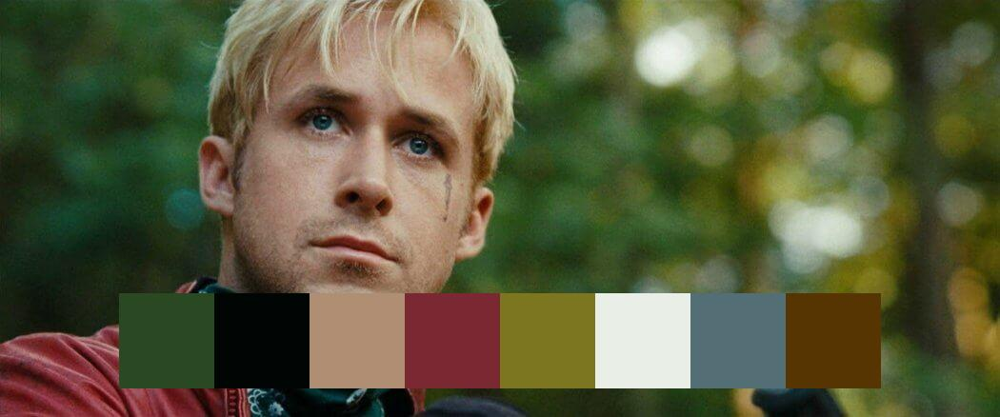

# Color Palette
I love watching movies and analyzing each frames in the movies. So I always thought of studying the color usage in each frames of iconic movies.

After getting inspired by this idea made a project to extract colors from a Image.
By this program we can return the colors as

- Color Palette
- RGB tuples
- List of HEX codes
- Fusing the palette over the uploaded image

More examples in the images folder. You can also try by providing the URL of your favourite image in the color.py file.