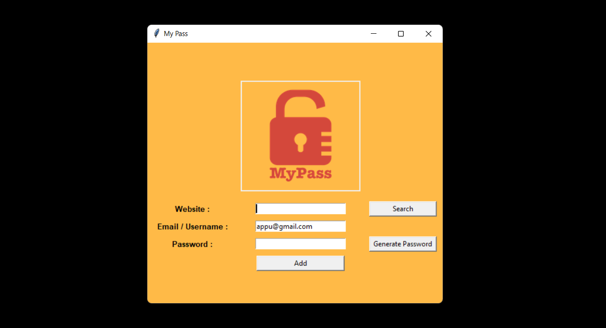
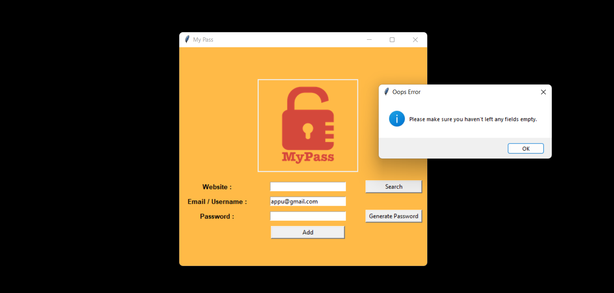
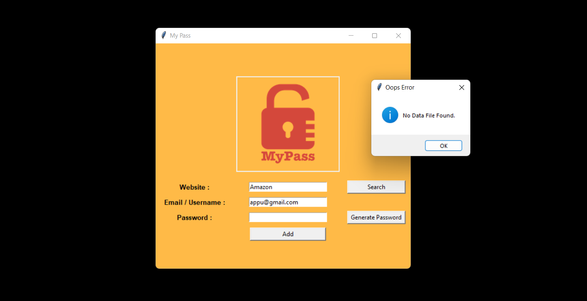
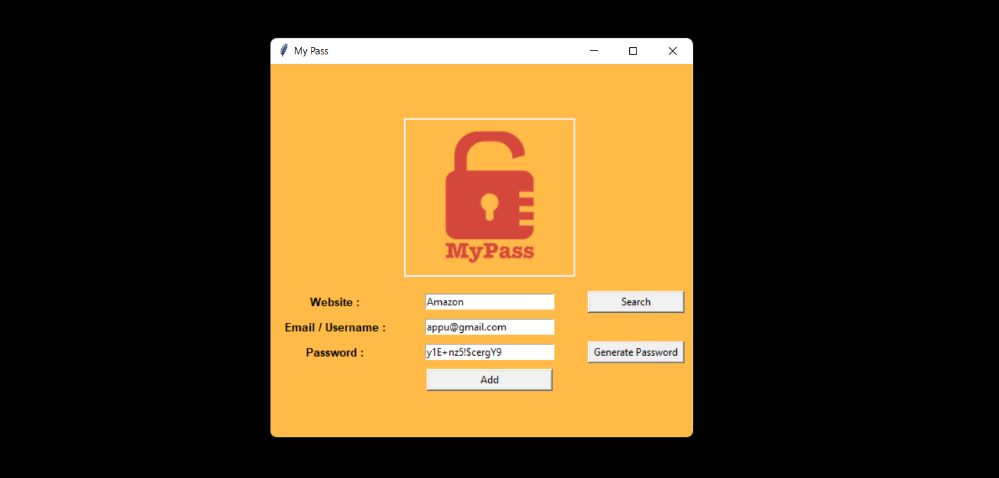
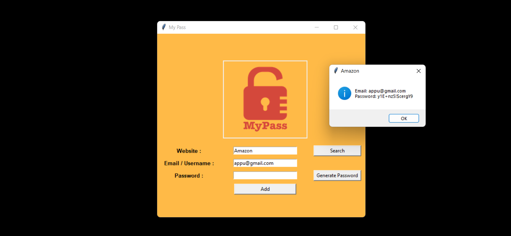

# My Pass
It is a simple and secure mini password manager program made using the tkinter module in Python.
## Program demo is attached below
### 1. Initial interface of the program. Since for personal use email will be auto filled. 
   
### 2. If we try to add the details without filling it shows an error pop up.
   
### 3. If we clicked the search button for unsaved website, It shows a pop up of data not found.
   
### 4. Generate password button provide a random strong password. Click add to save it.
   
### 5. If we hit search for a saved website it give email and password details in another tab. 
   
