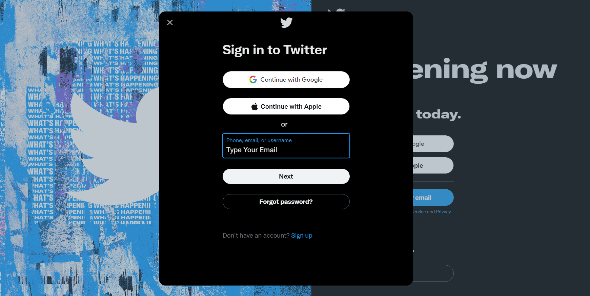
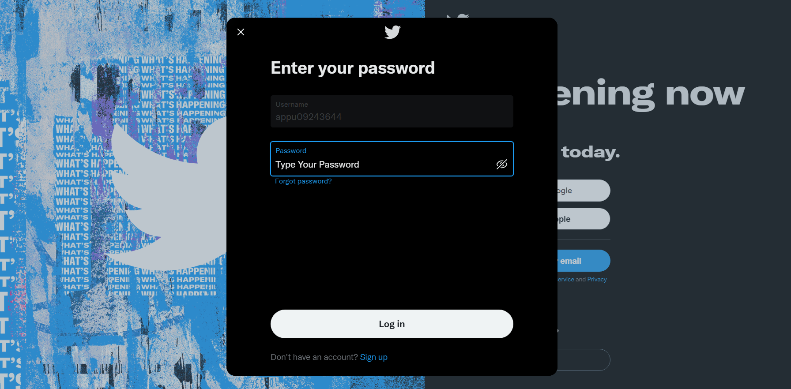
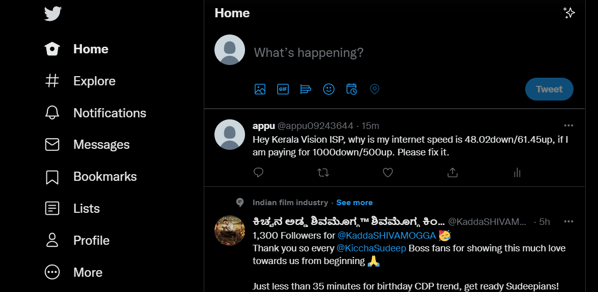

# Twitter Bot
Using Selenium Webdriver made a Twitter complaining bot, which checks our current internet speed using the Speed Test website and tweet about the speed if it is less than the promised speed. Attaching the automated process demo down below.

## 1. Opening the Speed Test Website. Clicking on the Go button.

## 2. Saving the download, upload speed and internet provider name.

## 3. Signing into twitter by entering email/username.

## 4. Entering the password. 

## 5. Reaching the home page and waiting for complete website loading.

## 6. Tweeting about internet speed issue by mentioning the service provider.

